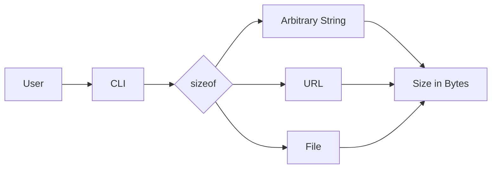

# sizeof

A command line tool that tells you the size of anything you pass to it in bytes initially, but also in human-legible terms by using simple comparisons to common snippets of text. 
 
 `sizeof` is also an experiment: I'm truly using it as an excuse to take some of the latest LLM models (such as ChatGPT 4, at the curent moment) for a walk in some "real" world software development contexts, and seeing if they 
 are indeed able to increase the speed, scope, ambition or delight of the project. I may or may not follow up by documenting my experiences in a video or blog post. 
CI
Go Report Card
License: MIT

sizeof is an open source command line tool written in Golang that helps users understand the size of various things, such as arbitrary strings, URLs, and even the websites or HTML pages that may reside at those URLs. This project is an experiment to scratch a small technical itch and to explore the capabilities of LLM technologies like ChatGPT 4 and GitHub's Copilot in the development workflow.
Table of Contents

    Installation
    Usage
    Features
    Contributing
    License

Installation

To install sizeof, download the latest binary for your platform from the Releases page. Then, follow the instructions specific to your operating system:

macOS and Linux:

    Make the binary executable:

bash

chmod +x sizeof

    Move the binary to your $PATH:

bash

sudo mv sizeof /usr/local/bin/

Windows:

    Move the sizeof.exe binary to a directory included in your %PATH% environment variable.

Usage

To use sizeof, simply run the command followed by the item you want to measure:

bash

sizeof <string | URL | file>

Examples:

bash

sizeof "Hello, World!"

bash

sizeof https://example.com

bash

sizeof ./path/to/local/file.html

Features

    Measure the size of arbitrary strings
    Measure the size of URLs
    Measure the size of websites or HTML pages residing at the provided URLs
    Outputs the size in bytes for all input types
    Leverages LLM technologies like ChatGPT 4 and GitHub's Copilot to improve development workflow

Contributing

Contributions are welcome! Please read the contributing guide to learn how to contribute to this project.
License

sizeof is MIT licensed.
