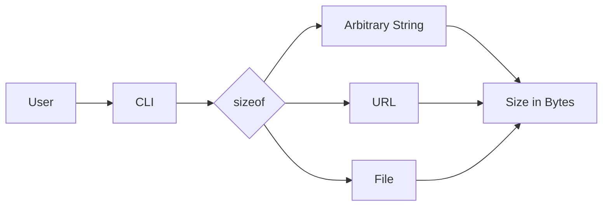

# sizeof

A command line tool that tells you the size of anything you pass to it in bytes initially, but also in human-legible terms by using simple comparisons to common snippets of text. 

sizeof is a command-line tool that helps you understand the size of various things such as arbitrary strings, URLs, and even the websites or HTML pages that may reside at those URLs. This project was born out of a personal itch to quickly gauge the size of different inputs and as an experiment to heavily leverage LLM technologies like ChatGPT-4 and GitHub's Copilot.


## Demo


Simply put, you give `sizeof` strings, URLs, and (eventually) filenames and you get back an easy-to-grok breakdown of the exact sizes of those things in bytes.
 
## Motivation

I like that old blog post about the relative speed and size of things (there's a bunch of them). This CLI is a step in that direction. By making it extremely cheap and fast to answer the question: "How big is that thing?", I hope to create my own habit of constantly checking and benchmarking the sizes and speeds of things when developing software.

 `sizeof` is also an experiment: I'm using it as an excuse to take some of the latest LLM models (such as ChatGPT 4, at the curent moment) for a walk in some "real" world software development contexts, and seeing if they 
 are indeed able to increase the speed, scope, ambition or delight of the project. I may or may not follow up by documenting my experiences in a video or blog post. 

## Table of Contents

- [Installation](#installation)
- [Usage](#usage)
- [License](#license)
- [Credits](#credits)

## Installation

To install sizeof, download the latest binary for your platform from the Releases page. Then, follow the instructions specific to your operating system:

### macOS and Linux:

Make the binary executable:

```bash
chmod +x sizeof
```

Move the binary to your $PATH:

```bash
sudo mv sizeof /usr/local/bin/
```

### Windows:

Move the sizeof.exe binary to a directory included in your %PATH% environment variable.

## Usage

```bash
sizeof <input>
```

Where <input> can be a string, URL, or file path. sizeof will determine the size of the input in bytes and display the result.

Here are some examples:

```bash
# Get the size of a string
sizeof "hello world"

# Get the size of a URL
sizeof "https://example.com"

# Get the size of a local HTML file
sizeof "/path/to/your/file.html"
```

## License

This project is licensed under the MIT License - see the [LICENSE](LICENSE) file for details.

## Credits 
This project was created by [Zachary Proser](https://github.com/zackproser) and was inspired by the desire to understand the size of various inputs and experiment with LLM technologies like ChatGPT-4 and GitHub's Copilot.
